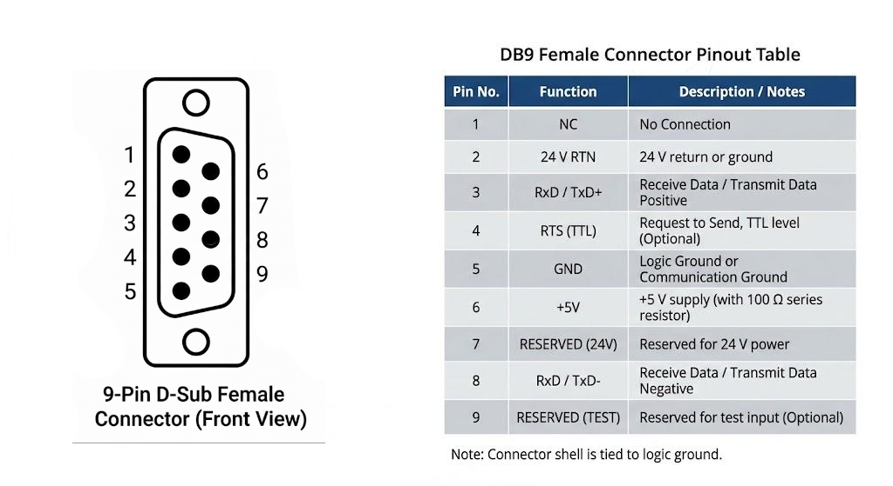
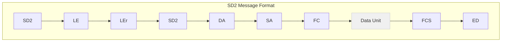
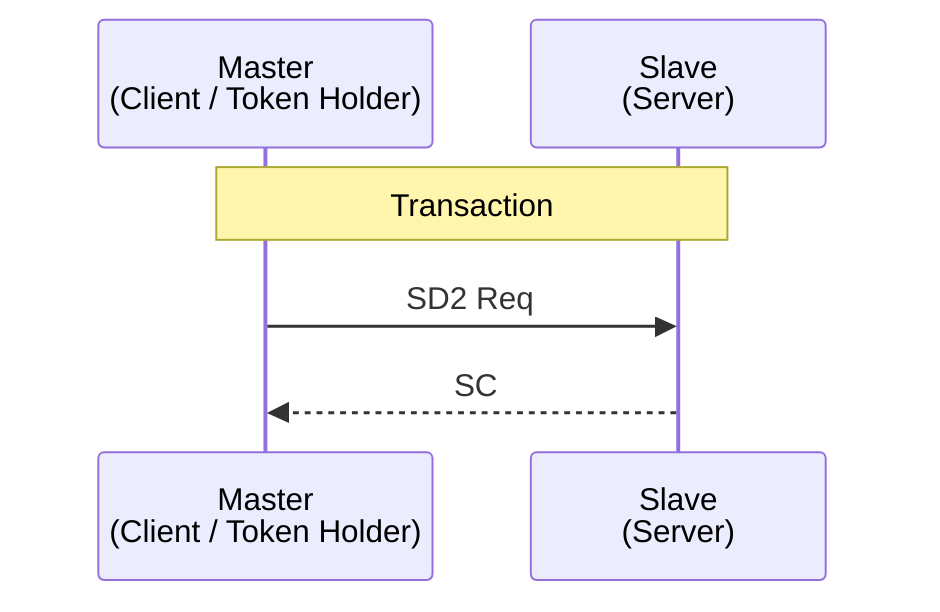
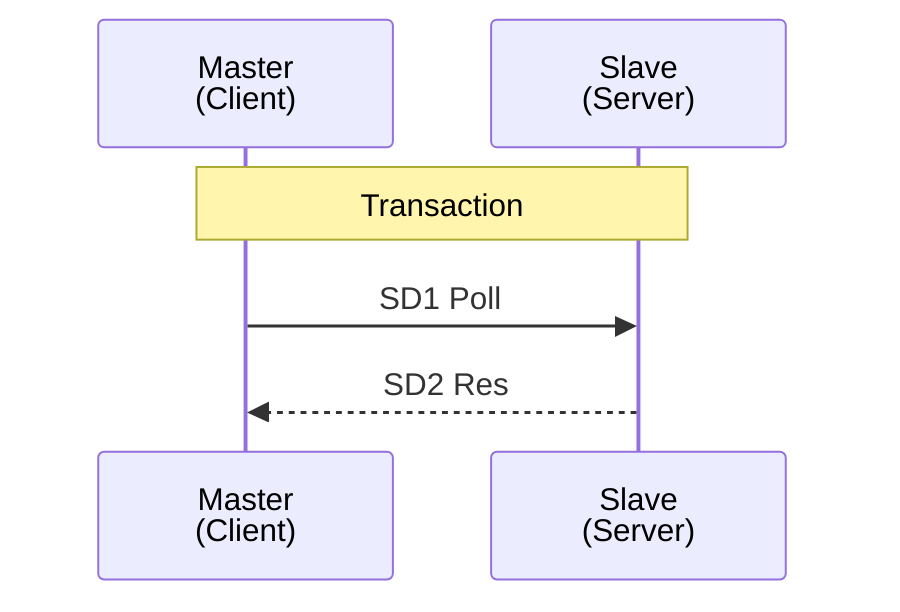
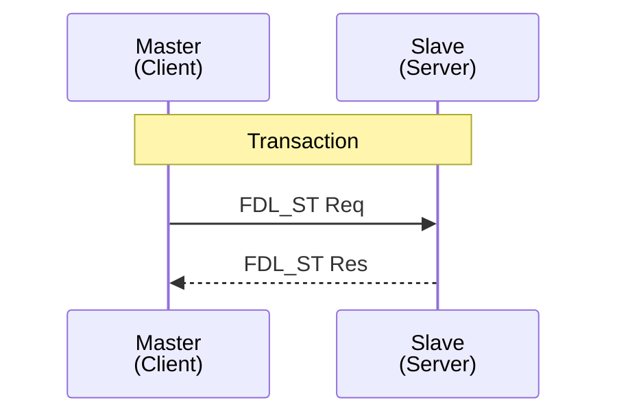
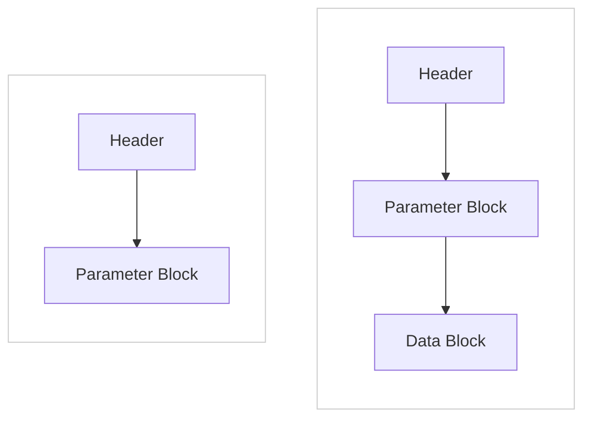
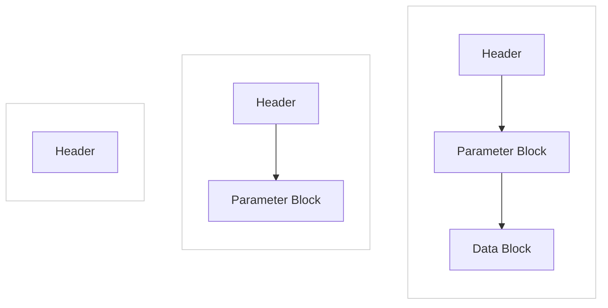
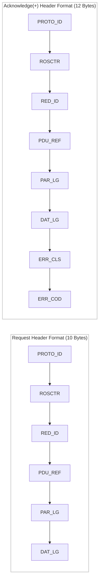

# Point-to-Point Interface (PPI)

**Release 1.0**

**August 14, 1996**

## Table of Contents

1. Introduction to the Point to Point (PPI) Communication Protocol
2. Layer 1 PPI Definition
3. Layer 2 PPI Definition
    1. Valid Request/Response Message Pairs and Exceptions
    2. Token Handling and Polling at Low and High Baud Rates
4. Layer 7 PPI Definition - Communication Services
    1. Header Definition Overview
    2. Parameter Block Definition Overview
    3. Data Block Definition Overview
    4. Simplified Representation of the Communication Sequence
    5. Establish an Association
    6. Data Read/Write Using the ANY Pointer
        1. Data Read
        2. Data Write
    7. Read Time of Day Clock
    8. Set Time of Day Clock

### Appendices

#### A. S7-200 Realization of PPI+ Protocol

1. Overview
2. Background Communication Supervisor
3. Standard PPI functions
4. PPI Layer Seven Error Codes
5. PPI Layer One
	1. Physical Implementation
	2. UART Interrupt
	3. Timer Interrupt
6. PPI Layer Two
	1. Offline
	2. Passive Idle(S7-214)
	3. Passive Idle(S7-212)
	4. Listen Token
	5. Claim Token
	6. Active Idle
	7. Use Token
	8. Await Response
	9. Check Access Time
	10. Pass Token
	11. Check Token Pass
	12. Await Status Response

#### B. S7-200 PPI+ Operating Parameters

1. PPI+ Simplifications
2. Actual Examples of S7-200 PPI Network Traffic

#### C. Medium Access Methods and Transmission Protocol
1. Profibus Overview
2. Fieldbus Data Link(FDL) Controller and Transmission Procedures
	1. Procedures for Token Handling
		1. Token Passing
		2. Addition and Removal of Slave and Master Stations
		3. Initializing/re-Initializing the Logical Token Ring
		4. Token Rotation Time
		5. Priorities of Messages
	2. Fieldbus Data Link(FDL) Controller States
		1. Offline
		2. Passive Idle
		3. Listen Token
		4. Active Idle
		5. Claim Token
		6. Use Token
		7. Await Data Response
		8. Check Access Time
		9. Pass Token
		10. Check Token Pass
		11. Await Status Response
	3. FDL Initialization

#### D. Recommended 3rd Party Device Testing
---

**Siemens Energy and Automation, Inc.**

**2805090**

**Company Confidential**

---

## 1.0 Introduction to the Point to Point Interface (PPI) Communication Protocol

This document defines the master/slave serial communication interface which is called Point to Point Interface (PPI). The communication protocol is based upon the PROFIBUS DIN Standard 19 245 using the seven layer OSI model. The PPI protocol will implement layers 1, 2, and 7. The remaining layers (layer 3, 4, 5, and 6) are null layers in the PPI implementation.

There are two basic types of PPI devices, masters and slaves. Master devices initiate all messages and hence must hold the token in order to initiate messages. A master device that does not currently hold the token may optionally be designed to respond to a PPI request as a slave. Slave devices are not token holders and therefore can never initiate a message.

---

## 2.0 Layer 1 PPI Definition

The electrical interface shall be provided through a nine pin D female style connector. The electrical signaling levels shall be RS485. The pinout of the nine pin D connector shall be as shown below.

Every PPI device shall provide a small internal bias on pins 3 and 8 of the nine pin D connector to prevent the line from chattering when the port is not being used. External bias and termination shall be provided by the user when cable lengths greater than 5 meters are required. The source for the external bias shall be provided by the PPI device on pin 6 of the D connector.

Each character of the PPI message shall have one start bit, eight data bits, an even parity bit, and one stop bit. No PPI device shall be required to detect and/or reject messages that are received with gaps between characters.

---

## 3.0 Layer 2 PPI Definition

After a TBDY time, PPI slave devices shall acknowledge, either negatively or positively, all incoming requests within a maximum station delay (TSDR). PPI devices shall detect a TSYN time and use this idle line time period to delineate the beginning of a new message. Once a TSYN time has been detected, the PPI devices shall copy the next message up to the destination address field. If the destination address field indicates that the message is for this station, the entire message will be copied and the appropriate response will be generated. If the destination address field indicates that the message is not for this station, the device shall discontinue copying the message and enter the state that searches for the next TSYN.

PPI devices are intended for point to point operation and shall require address initialization before being connected in a multi-drop configuration.

PPI devices do not support the address extensions defined in the PROFIBUS standard. Therefore, all requests are processed by way of the default service access point (SAP).

Network management including token initialization, recovery of a lost token and elimination of duplicate tokens shall be processed in accordance with the PROFIBUS standard.

Since all messages must be acknowledged within a station delay, the PPI slave will not be able to process the incoming message and generate the reply within the station delay time. Therefore, the requesting station shall be compelled to poll for the response after the request has been acknowledged. Each poll for the response shall be acknowledged and once a request has been processed and the response is ready, the PPI slave shall transmit the response in answer to the next poll.

The message and retry timing requirements are shown below.

The following communication parameters shall be used by all PPI devices as default parameters.

- Highest Station Address (HSA)  = 126
- Re-try count                   = 3
- Gap Update Factor (GUF)        = 1

PPI Slaves Shall Accept the Following Layer 2 Message Types:

1. SD2 frame for request data transfers (SRD low priority only)
2. SD1 frame for FDL_STATUS request
3. SD1 frame for polling
4. SD4 token message (the slave does not accept the token but recognizes the token message)

PPI Masters Shall Accept the Following Layer 2 Message Types:

1. SD2 frame for response data transfers
2. SD1 frame for FDL_STATUS response
3. SD1 frame for negative acknowledge (RR for no resource and RS for no service activated)
4. SC frame for single character acknowledge with no data
5. SD4 token message

---

The format of each of these frame types is shown in the following diagrams.

### Field Descriptions:

- SD2 : Start Delimiter 2 (68H)
- LE  : Length Byte
- LEr : Length Byte repeated
- DA  : Destination Address
- SA  : Source Address
- FC  : Frame Control

#### Data Unit : Message Data and Control (Length: n Bytes)
- FCS  : Frame Check Sequence
- ED  : End Delimiter (16H)

#### FC Byte Values (Request):

**SRD:**

	- 6CH (first message cycle)
	- 5CH (alternating FCB)
	- 7CH (alternating FCB)

FC Byte Values (Response):

**DL:**

	- 08H

### Note on FCS (Frame Check Sequence):

The FCS is the bytewise addition (8 bits with no Carry) of the message bytes starting with the DA and ending with the last byte of the data unit. LE is data unit length + 3 (DA/SA/FC).

---

## 3.1 Valid Request/Response Message Pairs and Exceptions

The following paragraphs provide general information about the handling of errors and re-tries.

The FC byte in the SD1 and SD2 frames is used to select the SRD (Send and Request Data) low priority message service and to control retries. When a station first attempts to initialize or restart communication with a slave, the requesting station shall set the value of the FC byte to 6CH in the first SD2 frame.

For subsequent polls and requests the value of the FC byte shall alternate from 05CH to 07CH. In the event that the response frame from the slave is received with an error or is not received at all, the master may re-try the message. A re-try shall be identified by repeating the message without changing the value of the FC byte. Likewise, when the slave recognizes a token pass after returning the SD2 response or receives a frame where the FC byte value has been changed from either 05CH to 07CH or from 07CH to 05CH, the slave can discard the previous data knowing that a retry for that data will not be required. The slave shall not detect protocol violations where the value of the FC byte does not alternate from one request to the next. Instead the slave shall respond appropriately to each request.

Messages with FC=06CH and FDL_STATUS may be repeated by the master, but there is no way for the slave to know if the message is being re-tried. The slave shall respond appropriately in these situations.

The FDL_Status request shall receive an immediate response containing the FDL_Status of the addressed unit. All SD2 requests will be acknowledged immediately with the SC acknowledge or a SD1 frame negative acknowledge (NAK). SD1 frame polls will be acknowledged until the SD2 response frame is ready. When the SD2 response frame is ready, it shall be transmitted in response to the next poll. Checksum and/or parity errors shall cause the slave to discard the message without making any type of response. The slave device shall immediately begin monitoring the communication line for a Tsync time after detection of an error.

If the master detects an error in the slave response, it may re-try the request. If after sending the prescribed number of retries without success, the master shall terminate the attempted message sequence.

The tables that follow describe the process by which the master and slave stations must exchange information. In all cases the issuance of a request, a poll or a response (in the case of the load sequence) by the master grants the slave the right to issue one message. The master shall not issue another request of any kind until the slave has responded or has been timed out by the master. Therefore, communication between the master and slave shall always be performed in message pairs that shall not be interrupted by other messages.

In between the message pairs exchanged by the master and the slave, the master is free to pass the token or issue requests to the same slave or to other stations. The master should be cognizant of the capabilities of the slave and should never issue requests that cannot be accepted by the slave.

---

#### Description

The master (token holder) issues a request to a slave. Upon receipt of a valid frame (no errors) that can be accepted, the slave acknowledges receipt of the frame by responding with a short character acknowledge (SC). After receipt of the SC acknowledge, the master is responsible for polling for the response.

After accepting the request, the slave shall process the request and generate an appropriate response. Upon receipt of the first poll from the requesting station after the response is available, the slave shall return the response.ExceptionsThe slave shall recognize retries of the same request and invoke the generation of a single response.

#### Exceptions

1. The slave shall recognize retries of the same request and invoke the generation of a single response.

2. Once the request has been accepted, the slave shall start a message sequence timeout timer. If the requestor does not poll for the response within this timeout time (currently 10 seconds for the S7-200) or waits longer than this timeout time between polls, the slave shall discard the request thereby terminating the message sequence.
Note: Token passes may occur between polling bursts.

3. If the slave does not respond to the request, the master may retry the request. If after sending the prescribed number of retries without success, the master shall terminate the attempted message sequence.

4. If the slave returns a no resource available (RR) or a no service activated (RS) negative acknowledge (NAK), the master shall terminate the attempted message sequence and try again in a subsequent token hold period.

5. If the slave returns an outstanding response (result of a previous request) in answer to this request, the master shall be responsible for discarding the response to the previous request. The master shall also be responsible for polling for the response to this request.

---

#### Description

After the master has issued a request to a slave and the slave has responded with an SC accepting the request, the master shall poll for the response.

The slave shall return the SD2 response that corresponds to the request for which the master is polling.

#### Exceptions

1. If there is no response available to be returned to the master, the slave shall return a SC. Even if there is no outstanding request from the master which issued the poll, the slave shall respond with SC.

2. Each poll from the master which issued the request for which the slave is preparing the response shall re-start the message sequence timeout timer. If this timer expires before the next poll for the response is received, the message sequence shall be terminated by the slave.

3. If the slave does not respond to the poll or if the master detects an error in the slave's response, the master may re-try the poll. If after sending the prescribed number of re-tries without success, the master shall terminate the attempted message sequence.

---

#### Description

When the master issues a FDL_Status request to a slave, the slave shall respond with a FDL_Status response.

#### Exceptions

1. If the slave does not respond to the request, the master may repeat the FDL_Status request or not, as is appropriate.

---

## 3.2 Token Handling and Polling at Low and High Baud Rates

For optimal network performance the method of polling should be dependent upon the baud rate of the network. For baud rates of 9.6KB and 19.2KB the master should poll for the response during the same token hold period in which the request was issued. If the slave does not return the response after the prescribed number of polls, the master shall pass the token.

For all baud rates higher than 19.2KB the master should not poll for the response during the same token hold period in which the request was issued.

---

## 4.0 Layer 7 PPI Definition - Communication Services

The communication services for the S7-200 constitute the data unit of the SD2 frame described in section 3.0.

Layer 7 defines the message or PDU (Protocol Data Unit) that is exchanged between the communication partners. Two types of PDUs are defined:

- Request PDUs
- Acknowledgment PDUs

All PDUs have the same basic format which consists of three parts:

- Header
- Parameter block
- Data block

The header is required with every PDU and contains the control information and the lengths of both the parameter and data fields. The parameters vary from service to service and are explained with the description of the individual services.

Service request PDUs always include both the header and the parameter fields, and may or may not include the data field. Acknowledge PDUs sometimes omit both the parameter and data fields. The following PDU formats are allowed.

### Allowed Request PDU Formats

### Allowed Acknowledge PDU Formats

### 4.1 Header Definition Overview

The following diagram shows the format of request and acknowledge headers.

### PDU Header Formats

#### Parameter Descriptions

- **PROTO_ID (UNSIGNED8)** Protocol Identification:

	32H for S7-200

- **ROSCTR (UNSIGNED8)** Remote Operating Services Control

  	Defined as follows:
	- 01H – Acknowledged request
	- 02H – Acknowledgement without the parameter and data fields
	- 03H – Acknowledgement with either or both the parameter and data fields

- **RED_ID (UNSIGNED16)** Redundancy Identification

	- 0000H – This parameter is intended for use with redundant concepts, and is not used at present.

- **PDU_REF (UNSIGNED16)** Protocol Data Unit Reference

	Each request message is assigned a PDU_REF that is unique to the connection over which the request is transmitted. When the corresponding acknowledgment to this request is generated, it must include this same PDU_REF so that the response can be correlated with the request.

- **PAR_LG (UNSIGNED16)**  Parameter Length

	PAR_LG specifies the entire length of the parameter block in bytes.

- **DAT_LG (UNSIGNED16)** Data Length

	DAT_LG specifies the entire length of the data block in bytes.

- **ERR_CLS (UNSIGNED8) / ERR_COD (UNSIGNED8)** Error Class / Error Code

	Positive acknowledgments return a value of **00H** in both fields, while negative acknowledgments return a non-zero value in each field. These fields provide protocol or application specific error indications. The values for the error class field are given in the following table. The values for the error code field are given with the definition for the various request and response service formats.

	| ERR_CLS | Description of Protocol Specific Errors |
	|--------:|------------------------------------------|
	| 00H     | No error                                 |
	| 81H     | Error in the application ID of the request |
	| 82H     | Error in the object definition (e.g. bad data type) |
	| 83H     | No resources available                  |
	| 84H     | Error in the structure of the service request |
	| 85H     | Error in the communication equipment    |
	| 87H     | Access Error                            |

	| ERR_CLS | Description of Application Specific Errors |
	|--------:|---------------------------------------------|
	| D2H     | OVS error                                   |
	| D4H     | Diagnostic error                            |
	| D6H     | Protection system error                    |
	| D8H     | BuB error                                   |
	| EFH     | Layer 2 specific error                     |

**Note:** The unused error codes from **D0H** to **EFH** are reserved for future expansion.

### 4.2 Parameter Block Definition Overview

The construction of the parameter block is specified for each service request and response. The first parameter of the parameter block is always the service identifier and is found in all requests and positive acknowledgments (if the acknowledgment has a parameter block).

**SERVICE_ID (UNSIGNED8)** Service Identification

The service identifications are generally classified as services with acknowledgment or services without acknowledgment. For those services which are acknowledged, the request and the response have the same service identification. The services in each group can be distinguished by the ROSCTR parameter in the header. The following table lists the various service ID's.

